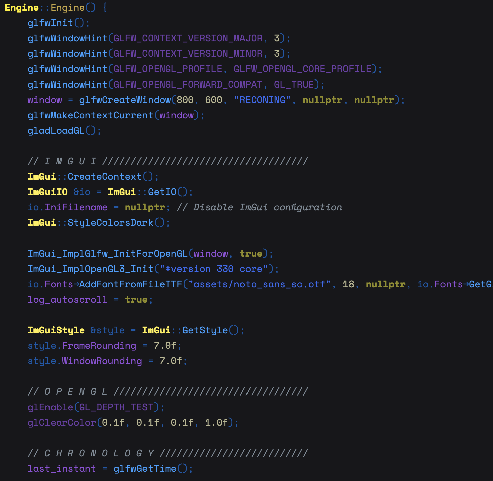
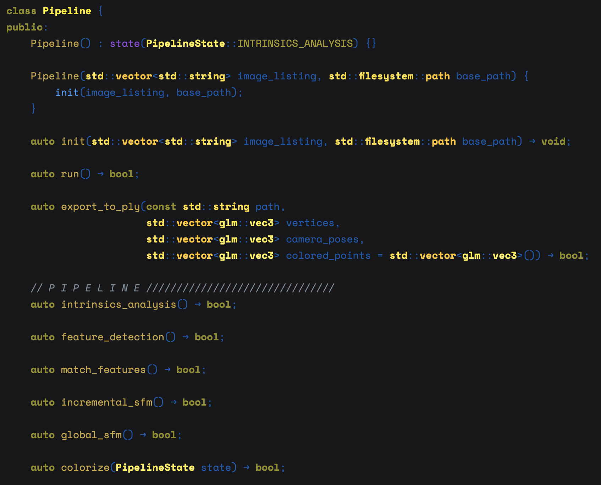

# Deep Space for Xcode

Stars shining in the distance, mixed together with nebula and general nothingness

# How does it look?

# How can I install it?

Probably just drag the `Space.xccolortheme` to your `~/Library/Developer/Xcode/UserData/FontAndColorThemes/`

# Font?

It's [Space Mono](https://fonts.google.com/specimen/Space+Mono?category=Monospace)
